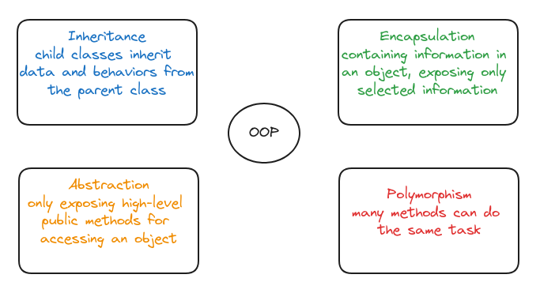

# Object Oriented Programming 

Object-oriented programming (OOP) is a computer programming model that organizes software design around data, or objects, rather than functions and logic.

## Benefits
- The organization of an object-oriented program also makes the method beneficial to collaborative development
- OOP include code reusability, scalability and efficiency.
- **Modularity** Encapsulation enables objects to be self-contained, making troubleshooting and collaborative development easier.
- **Reusability** Code can be reused through inheritance, meaning a team does not have to write the same code multiple times.
- **Productivity** Programmers can construct new programs quicker through the use of multiple libraries and reusable code.
- **Easily upgradable and scalable** Programmers can implement system functionalities independently.
- **Interface descriptions** Descriptions of external systems are simple, due to message passing techniques that are used for objects communication.
- **Security** Using encapsulation and abstraction, complex code is hidden, software maintenance is easier and internet protocols are protected.
- **Flexibility** Polymorphism enables a single function to adapt to the class it is placed in. Different objects can also pass through the same interface.

## Structure of Object-Oriented Programming

**Classes** are user-defined data types that act as the blueprint for individual objects, attributes and methods.

**Objects** are instances of a class created with specifically defined data.

Objects have states and behaviors. The state of an object is defined by data: things like names, birthdates, and other information you’d want to store about a dog. Behaviors are methods the object can undertake.

**Methods** are functions that are defined inside a class that describe the behaviors of an object. 

**Attributes** are defined in the class template and represent the state of an object.

## OOP Principles

**Encapsulation** This principle states that all important information is contained inside an object and only select information is exposed.
- Encapsulation adds security
- JavaScript has private and protected properties and methods. Protected Fields are prefixed with a **_** ; private fields are prefixed with a **#**. Protected fields are inherited. Private ones aren’t.

**Abstraction** Objects only reveal internal mechanisms that are relevant for the use of other objects, hiding any unnecessary implementation code. 
- Abstraction also serves an important security role
- Reduces complexity and improves code readability
- Facilitates code reuse and organization
- Data hiding improves data security by hiding sensitive details from users
- Enhances productivity by abstracting away low-level details

**Inheritance** Classes can reuse code from other classes. Relationships and subclasses between objects can be assigned, enabling developers to reuse common logic while still maintaining a unique hierarchy.
- Inheritance supports reusability.
- The benefits of inheritance are programs can create a generic parent class and then create more specific child classes as needed.
- In JavaScript, inheritance is also known as prototyping.

**Polymorphism** Objects are designed to share behaviors and they can take on more than one form. Polymorphism allows different types of objects to pass through the same interface.
- Polymorphism means designing objects to share behaviors.
- **Method Overriding**: Runtime polymorphism uses method overriding. In method overriding, a child class can implement differently than its parent class.
- **Method Overloading**: Compile Time polymorphism uses method overloading. Methods or functions may have the same name but a different number of parameters passed into the method call.

References:

- [educative.io](https://www.educative.io/blog/object-oriented-programming)

- [techtarget.com](https://www.techtarget.com/searchapparchitecture/definition/object-oriented-programming-OOP#:~:text=Object%2Doriented%20programming%20(OOP)%20is%20a%20computer%20programming%20model,has%20unique%20attributes%20and%20behavior.)