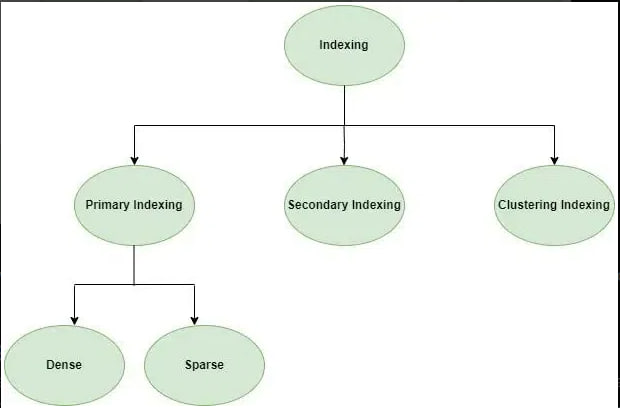

# Index in Database

## Definition
Indexes are a powerful tool used in the background of a database to speed up querying. Indexes power queries by providing a method to quickly lookup the requested data.

If you most often insert, update, and delete records, then the fewer indexes associated with the table, the better the performance. 

If you most often retrieve records, you must look further to define the criteria for retrieving records and create indexes to improve the performance of these retrievals.

Here are a few rules to help you decide which indexes to create:

- If your record retrievals are based on one field at a time (for example, dept='D101'), create an index on these fields.
- If your record retrievals are based on a combination of fields, look at the combinations.
- If the comparison operator for the conditions is AND (for example, CITY = 'Raleigh' AND STATE = 'NC'), then build a concatenated index on the CITY and STATE fields. This index is also useful for retrieving records based on the CITY field.
- If the comparison operator is OR (for example, DEPT = 'D101' OR HIRE_DATE > {01/30/89}), an index does not help performance. Therefore, you need not create one.

## Database Indexes Structure

#### Sequential File Organization or Ordered Index File
- Dense:For every search key value in the data file, there is an index record.
- Sparse: The index record appears only for a few items in the data file. Each item points to a block as shown. 

#### Hash File organization
- Clustered Indexing: When more than two records are stored in the same file this type of storing is known as cluster indexing. By using cluster indexing we can reduce the cost of searching reason being multiple records related to the same thing are stored in one place.
- Primary Indexing: This is a type of Clustered Indexing wherein the data is sorted according to the search key and the primary key of the database table is used to create the index, the performance of the searching operation is quite efficient. 
- Non-clustered or Secondary Indexing: A non-clustered index just tells us where the data lies, it gives us a list of virtual pointers or references to the location where the data is actually stored. 
- Multilevel Indexing: A hierarchical structure of indexes. Here, each level of the index provides a more detailed reference to the data. It allows faster data retrieval, reduces disk access, and improves query performance. Multilevel indexes are essential in large databases where traditional indexes are not efficient. (Example: B-Tree Index)

## Attributes of Indexing
- Access Types: This refers to the type of access such as value-based search, range access, etc.
- Access Time: It refers to the time needed to find a particular data element or set of elements.
- Insertion Time: It refers to the time taken to find the appropriate space and insert new data.
- Deletion Time: Time taken to find an item and delete it as well as update the index structure.
- Space Overhead: It refers to the additional space required by the index.

## Advantages
- An index is a database structure that you can use to improve the performance of database activity.

- Efficient Data Access: Indexing can enhance data access efficiency by lowering the amount of disk I/O
- Optimized Data Sorting: the database can avoid sorting the entire table and instead sort only the relevant rows.
- 
- 
- 
## Disadvantage

- Indexes can slow down the performance of some inserts, updates, and deletes when the driver has to maintain the indexes as well as the database tables.
- Indexes take additional disk space.
- Choosing an index can be difficult

### References
- [progress.com](https://www.progress.com/tutorials/odbc/using-indexes#:~:text=An%20index%20is%20a%20database,single%20field%20name%2C%20like%20EMP_ID.)
- [geeksforgeeks](https://www.geeksforgeeks.org/indexing-in-databases-set-1/)